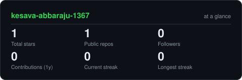
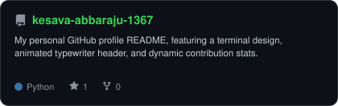

<div align="center">

<!-- PORTRAIT - generated by scripts/dotify.py from assets/jacket.png.
     Colour mode, so one file serves both GitHub themes. Regenerate with:
       python scripts/dotify.py assets/jacket.png -o assets/portrait \
         --cols 100 --equalize --detail 0.5 --color -->


<br>

<!-- NAME / TAGLINE - animated typing -->
<a href="https://github.com/kesava-abbaraju-1367">
  
</a>

<br>

<!-- SOCIALS -->
<a href="https://www.linkedin.com/in/abbaraju-kesava-a7539217a/"></a>
<a href="mailto:abbaraju.kesava@bizacuity.com"></a>
<a href="https://leetcode.com/u/abbarajukesava/"></a>
<a href="https://www.hackerrank.com/profile/kesava_007"></a>


</div>

---

## `~/` whoami

```console
$ cat about.txt
```

Hi, I'm **Kesava**. I build backend applications, automate workflows, and explore data science and AI models.

- Focus: **Python, Data Analysis, and Agentic Automation**
- Learning: **Deep Learning & Large Language Models**
- Fun fact: **I love automation and pair-programming with AI assistants!**

<br>

<div align="center">
  <a href="https://github.com/kesava-abbaraju-1367">
    
  </a>
</div>

<br>

<div align="center">

## `~/` toolbox


</div>

---

<div align="center">

## `~/` skill radar

<table>
<tr>
<td width="50%" align="center" valign="middle">

<!-- Self-rated radar - edit assets/skills.json, the workflow redraws it -->
<picture>
  <source media="(prefers-color-scheme: dark)"  srcset="assets/radar-dark.svg">
  <source media="(prefers-color-scheme: light)" srcset="assets/radar-light.svg">
  
</picture>

</td>
<td width="50%" align="center" valign="middle">

<!-- Live radar built from real language byte counts across your repos -->
<picture>
  <source media="(prefers-color-scheme: dark)"  srcset="assets/radar-langs-dark.svg">
  <source media="(prefers-color-scheme: light)" srcset="assets/radar-langs-light.svg">
  
</picture>

</td>
</tr>
</table>

</div>

---

<div align="center">

## `~/` contribution calendar

<!-- Snake eats the contribution graph - .github/workflows/snake.yml -->
<picture>
  <source media="(prefers-color-scheme: dark)"  srcset="https://raw.githubusercontent.com/kesava-abbaraju-1367/kesava-abbaraju-1367/output/snake-dark.svg">
  <source media="(prefers-color-scheme: light)" srcset="https://raw.githubusercontent.com/kesava-abbaraju-1367/kesava-abbaraju-1367/output/snake.svg">
  
</picture>

</div>

---

<div align="center">

## `~/` the numbers

<!-- Generated by scripts/cards.py into this repo. Deliberately NOT
     github-readme-stats / streak-stats / github-profile-trophy: those are
     shared public instances that go down and take the whole section with them. -->
<picture>
  <source media="(prefers-color-scheme: dark)"  srcset="assets/card-stats-dark.svg">
  <source media="(prefers-color-scheme: light)" srcset="assets/card-stats-light.svg">
  
</picture>

<br>

<a href="https://github.com/DenverCoder1/github-readme-streak-stats">
  
</a>


</div>

<div align="center">

## `~/` 🎮 tic-tac-toe

| | | |
| :-: | :-: | :-: |
| <a href="https://github.com/kesava-abbaraju-1367/kesava-abbaraju-1367/issues/new?title=tictactoe%7C1&body=Click+Submit+new+issue+to+place+your+move!">⬜</a> | <a href="https://github.com/kesava-abbaraju-1367/kesava-abbaraju-1367/issues/new?title=tictactoe%7C2&body=Click+Submit+new+issue+to+place+your+move!">❌</a> | <a href="https://github.com/kesava-abbaraju-1367/kesava-abbaraju-1367/issues/new?title=tictactoe%7C3&body=Click+Submit+new+issue+to+place+your+move!">⭕</a> |
| <a href="https://github.com/kesava-abbaraju-1367/kesava-abbaraju-1367/issues/new?title=tictactoe%7C4&body=Click+Submit+new+issue+to+place+your+move!">⭕</a> | <a href="https://github.com/kesava-abbaraju-1367/kesava-abbaraju-1367/issues/new?title=tictactoe%7C5&body=Click+Submit+new+issue+to+place+your+move!">❌</a> | <a href="https://github.com/kesava-abbaraju-1367/kesava-abbaraju-1367/issues/new?title=tictactoe%7C6&body=Click+Submit+new+issue+to+place+your+move!">⬜</a> |
| <a href="https://github.com/kesava-abbaraju-1367/kesava-abbaraju-1367/issues/new?title=tictactoe%7C7&body=Click+Submit+new+issue+to+place+your+move!">⬜</a> | <a href="https://github.com/kesava-abbaraju-1367/kesava-abbaraju-1367/issues/new?title=tictactoe%7C8&body=Click+Submit+new+issue+to+place+your+move!">⭕</a> | <a href="https://github.com/kesava-abbaraju-1367/kesava-abbaraju-1367/issues/new?title=tictactoe%7C9&body=Click+Submit+new+issue+to+place+your+move!">❌</a> |

<sub><i>Click on any empty cell (⬜) to place your move!</i></sub>

</div>

---

<div align="center">

## `~/` selected work

<a href="https://github.com/kesava-abbaraju-1367/kesava-abbaraju-1367">
  <picture>
    <source media="(prefers-color-scheme: dark)"  srcset="assets/card-kesava-abbaraju-1367-dark.svg">
    <source media="(prefers-color-scheme: light)" srcset="assets/card-kesava-abbaraju-1367-light.svg">
    
  </picture>
</a>

</div>

---

<div align="center">

<sub>`01110100 01101000 01100001 01101110 01101011 01110011 00100000 01100110 01101111 01110010 00100000 01110011 01100011 01110010 01101111 01101100 01101100 01101001 01101110 01100111`</sub>

</div>
